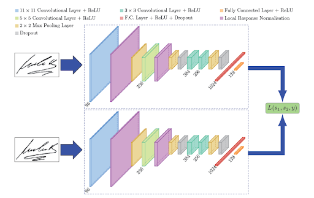
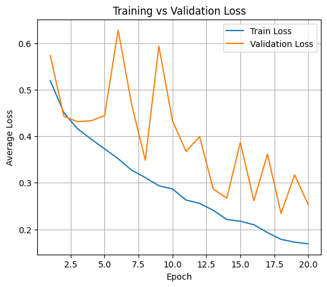
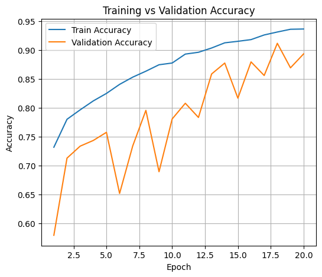
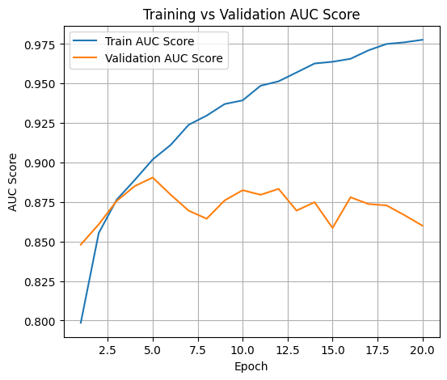
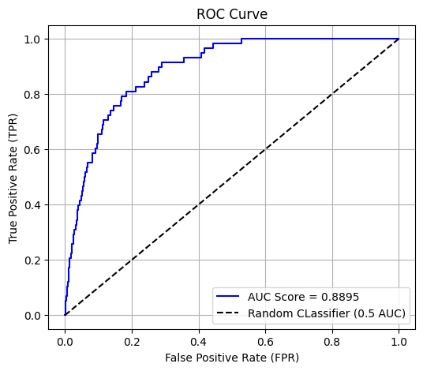

# Siamese Network Classification on ISIC 2020 Kaggle Dataset using Contrastive Loss

## Problem to solve

Using the ISIC 2020 kaggle dataset and being able to classify images as benign or malignant skin images. Where benign is labeled as 0 and malignant is labeled as 1. The main difficulty with this problem is that around 98% were benign images and only 2% were malignant images, showing a severe imbalance in the classes. The goal of the model is to achieve above 80% accuracy.

## Model Description and Loss Function 

The Siamese architecture backbone is based off the following Figure 1 seen below where the input into the model is a pair of images and a pair label with 0 for different classes and 1 for similar classes.:

Figure 1: Siamese Network Layout [1]

Minor modifications have been done to this layout such as different kernel sizes and fully connected layer amounts, as well as more batch normalization and max pooling layers being used. The main significance is that this model has a head layer of fully connected layers that converts the outputted embeddings into a probability between the two skin classes.

Because the model outputs probabilities the Binary Cross Entropy loss function has been utilized to optimize the model in predicting the correct classes. This loss function can be seen below:

LBCE = $-\frac{1}{N}\sum_{i=1}^{N}\left[y_i\log(p_i) + (1 - y_i)\log(1 - p_i)\right]$

[2]

## Data Preprocessing

The train data was split into the following datasets train/validation/test with the following ratio 0.75/0.15/0.10. This allowed the creation of three datasets to train, validate and then test the model on. The original train dataset has around 33,000 images this split allows for each dataset to have sufficient data to train properly, receive valid validation metrics with losses and have a sufficiently large test set.

Further preprocessing was done where the images were resized to 224x224. Three data augmentations were done doing training which were random vertical flip, random horizontal flip, and finally random rotation at 20 degrees. These augmentations were done to provide the model more training variety, with the goal of increasing the models generalization capabilities. The RGB pixel intensity values were then scaled to a range of 0 to 1 and then normalized with mean = 0.5 and standard deviation = 0.5 for each pixel intensity.

A random weighted sampler was created for the train dataloader which allowed the loader to over sample the marginalized malignant class to provide more sample for the model to train on.

## Model Performance

### Training

The model was trained for 20 epochs and lead to the following plots and results:

From the AUC plot above it seems that the model had started to overfit as both validation and training AUC scores were gradually separating. Even though this has occurred the best model was just the model that has been trained to 20 epochs and this was saved to be used in the evaluation. Below is a classification report of the validation set at epoch 20:

### Validation Classification Report:

| Class           | Precision | Recall | F1-Score | Support |
|-----------------|------------|---------|-----------|----------|
| **0.0**         | 0.99 | 0.90 | 0.94 | 4881 |
| **1.0**         | 0.09 | 0.55 | 0.15 | 88 |
| **Accuracy**    |            |         | 0.89 | 4969 |
| **Macro Avg**   | 0.54 | 0.72 | 0.55 | 4969 |
| **Weighted Avg**| 0.98 | 0.89 | 0.93 | 4969 |

This showed the model had achieved extremely well with class 0 with a high F1 score but struggles with class 1 with only a precision of 0.09 and a low F1 score. This can be due to the low amount of malignant images in the dataset and can also be from the high recall showing the model predicts a large number of false positives.

### Testing
The model achieved the following ROC curve results:

It can be seen that the model performed much better than a random classifier with an AUC score of 0.8895. Below a classification report has been produced from this test set:

### Test Classification Report:

| Class           | Precision | Recall | F1-Score | Support |
|-----------------|------------|---------|-----------|----------|
| **0.0**         | 0.99 | 0.91 | 0.95 | 3255 |
| **1.0**         | 0.10 | 0.59 | 0.18 | 58 |
| **Accuracy**    |            |         | 0.90 | 3313 |
| **Macro Avg**   | 0.55 | 0.75 | 0.56 | 3313 |
| **Weighted Avg**| 0.98 | 0.90 | 0.94 | 3313 |

### Test set accuracy is 90%

### Confusion Matrix
|                | **Predicted 0** | **Predicted 1** |
|----------------|-----------------|-----------------|
| **Actual 0**   | 2963 | 292 |
| **Actual 1**   | 24   | 34  |

From the results above it can be seen that the results are very similar to the validation results with class 0 being predicted very well, but class 1 not so much due to the high recall the model has. From the confusion matrix it can be observed that the model predicts more than half of the actual malignant images correctly however it is only around 59% accurate just above a random classifier. 

This shows that the given model can understand the saturated class 0 but struggles to learn distinguishing features for class 1, leading to further refinement needed to improve this class. The next step would be trying to use a prebuilt model like resnet to see if any more significant progress can be achieved in establishing distinguishing embedded features. However, overall the model achieved an accuracy of 90% which satisfies the problem that this model was initially design for which was trying to achieve accuracy greater than 80% on the ISIC 2020 dataset.

## Environment/Dependencies

This project was completed using the conda environment. The environment can be created using the following code:

    conda env create -f environment.yml

## Usage

Run all commands from the root directory

### File Setup

    mkdir data

### Correct directory for files

Download the ISIC 2020 kaggle dataset and make sure the file names are file paths are the same as below:

    data
    ----image
    ----train_metadata.csv

## Model Training

To get the model to train use the following code to train the model and save the trained model:

    python train.py

## Model Evaluation

To get the model to evaluate on some test data after training and produce some plots and classification report use the following code:

    python predict.py

## References

[1] Sean Benhur, “A Friendly Introduction to Siamese Networks,” Built In, April 3 2025. [Online]. Available: https://builtin.com/machine-learning/siamese-network. [Accessed: Oct. 30 2025].

[2] Sanchhaya Education Private Ltd., “Binary Cross Entropy/Log Loss for Binary Classification,” GeeksforGeeks, July 23 2025. [Online]. Available: https://www.geeksforgeeks.org/deep-learning/binary-cross-entropy-log-loss-for-binary-classification/. [Accessed: Oct. 30 2025].